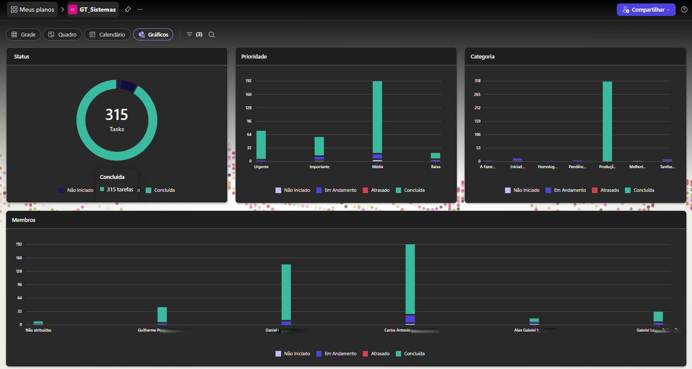

# Diretrizes gerais para o uso de Inteligência Artificial no suporte ao Desenvolvimento de Software

## SERIN - Secretaria de Relações Intitucionais do Estado da Bahia (APG / CGOTIC)

## Contexto

**Inteligência Artificial (IA)**: Sistemas computacionais que imitam a forma como humanos pensam e aprendem, superando-os em velocidade e na capacidade de processar grandes volumes de informação simultaneamente.

**Machine Learning (ML)**: Uma subárea da IA onde os computadores aprendem a partir de dados, em vez de seguirem regras rígidas de programação. Exemplos de ML:

* Clássico:
    * Aprendizado Supervisionado
        * Classificação
        * Regressão
    * Aprendizado Não Supervisionado
        * Clustering 
        * Associação
* Aprendizado por Reforço
* Redes Neurais 
    * IA Generativa

### Casos de uso - *IA Tradicional*: 

* Sistemas de Recomendação. Exemplos: Netflix, Spotify;
* Detecção de Fraude e Anomalias no setor bancário e de segurança;
* Visão Computacional. Exemplos: Reconhecimento de imagens, reconhecimento facial, etc;
* Análise de Sentimento, muito usado por marcas para monitorar redes sociais e classificar se a opinião pública é positiva, negativa ou neutra;
* Manutenção Preditiva, comum na indústria 4.0, analisando milhares de parâmetros de equipamentos, antecedendo problemas antes de acontecerem.

Alguns artigos escritos por mim sobre o tema, publicados no ano de 2020 : 

* [Inteligência Artificial](https://carlossalesti.gitbook.io/inteligencia-artificial-1)
* [Machine Learning](https://carlossalesti.gitbook.io/machine-learning)
* [Regressão Linear](https://carlossalesti.gitbook.io/linear-regression)
* [Futuro do Trabalho](https://carlossalesnaturaltec.github.io/Futuro_do_Trabalho/)


## IA Generativa

Uma aplicação específica dentro do Deep Learning focada em **CRIAR NOVOS DADOS**, em vez de apenas classificar ou prever dados existentes.

* Entendimento de linguagem natural: Chatbots, tradução automática, pesquisas;
* Análise de grandes volumes de dados. Exemplo: resumo de LOGS, artigos acadêmicos, livros, etc;
* Criação de imagens, áudio e vídeo;
* Desenvolvimento e análise de Software.

## IA Generativa no auxílio ao Desenvolvimento de Software

* Identificação de bugs;
* Geração de documentação;
* Desenvolvimento de novas funcionalidades;
* Aumento de produtividade: código gerado em segundos;
* Suporte no aprendizado de novas linguagens de programação e frameworks.

### Casos de uso:

* Utilizando a interface de um fornecedor como ChatGPT, Gemini, Claude, etc. Pesquisando, copiando e colando trechos de código avulsos;
* Em conjunto com a IDE. Exemplos: 
    * COPILOT: autocomplete, etc;
    * Cursor: IDE baseada no VS Code com chat integrado ao código.
* Ferramentas **CLI - Command Line Interface**. Capazes de executar comandos como git, dir, bash, etc. Além de ler, criar e excluir arquivos. Exemplos:
    * Claude Code
    * Gemini CLI
    * Codex

## SERIN/APG/CGOTIC - Atribuições do setor de Desenvolvimento de Software

* Manutenção em Sistema legado:
    * Correção de bugs;
    * Desenvolvimento de novas funcionalidades;
    * Integração com terceiros (Rh Bahia, Infobip Teledata, Painel Power BI, etc)
* Consultas avulsas em banco de dados, geração de planilhas;
* Análise de Logs **reativa e preventiva**;
* Correção de vulnerabilidades e depreciação de Libs.

### Complexidade do Software Legado (SIS - Sistema Integrado SERIN)

```
  ┌─────────────────────────────────────────────────────────────────┐
  │                    SIS - NÚMEROS MACRO                          │
  ├─────────────────────────────────────────────────────────────────┤
  │                                                                 │
  │  BACKEND (Laravel / PHP / PostgreSQL)                           │
  │  ──────────────────────────────────────────                     │
  │  📦 Arquivos PHP (app/)       532                              │
  │  🎛️ Controllers               143 classes                      │
  │  🧩 Models                    198                              │  
  │  🔧 Artisan Commands           41                              │
  │  📁 Migrations                182                              │  
  │  🗂️ Route files                22                              │
  │                                                                 │
  │  FRONTEND (Vue + Inertia.js + Tailwind)                         │
  │  ─────────────────────────────────────────                      │
  │  📄 Pages (.vue)               534                              │
  │  🧱 Shared Components           19                              │
  │  🏪 Pinia Stores                44                              │
  │  📝 ~29.000 linhas JS/Vue                                       │
  │                                                                 │
  │  DATABASE (PostgreSQL Multi-Schema)                             │
  │  ─────────────────────────────────                              │
  │  🗄️ Schemas/Connections:  12                                   │  
  │                                                                 │
  └─────────────────────────────────────────────────────────────────┘

```

### Tarefas realizadas pela equipe no período Abr/2025 a Abr/2026



| Tarefa | Quantidade | Observações |
|:----------|:--------|:--------|
| Concluídas | 315 | Últimos 12 meses |
| Em Andamento | 23 | Incluindo tarefas com pendência do usuário |
| Não Iniciada | 04 | Aguardando na fila|

### Problemas enfrentados pelo Setor

* Alto volume de tarefas/demandas. 
* Equipe disponível:
    * 01 Analista + 02 estagiários;    
    * Analista atuando como Desenvolvedor, Líder Técnico, Code reviewer e na orientação e suporte aos estagiários.
* Ausência de Documentação Oficial do Sistema gerando dificuldade no *On board* de novos membros;
* Uso de IA de forma não coordenada, gerando códigos "avulsos" e eventualmente incompatível com a estrutura existente;
* Risco à exposição de dados sensíveis (banco de dados, credenciais, etc);
* Entendimento sobre uso de **Janela de Contexto** no desenvolvimento de features extensas. *Limitação dos modelos de IA em manter coerência em tarefas muito longas ou complexas.*

## Desenvolvimento Orientado a Especificações / SDD (Specification-Driven Development)

Para endereçar esses problemas e riscos, especialmente no uso não coordenado de IA e no acúmulo de demandas pela equipe, propomos a adoção de uma metodologia baseada em especificações: o **SDD**.

**SDD** é uma metodologia onde a especificação técnica (o "contrato" do que o software deve fazer) é escrita antes da implementação do código. É um pilar fundamental da Engenharia de Software Moderna, especialmente em arquiteturas de microserviços e APIs.

### Ferramentas comuns:

* BMAD
* GitHub Spec Kit
* Kiro (AWS)
* OpenSpec

Dentre as ferramentas disponíveis, destacamos o **OpenSpec** por ser independente de fornecedor e compatível com os principais ambientes do mercado.

### OpenSpec

* Indicado para projetos do tipo: 
    * Greenfield - Sistemas novos;
    * Brownfield - Sistemas legados. Analisa estrutura existente do código antes de propor ou implementar.
* Independe de fornecedor. Compatível com as principais plataformas: Claude Code, Cursor, Gemini, GitHub Copilot, Windsurf, etc;
* Funciona melhor com modelos de alta capacidade de raciocínio;
* Repositório oficial : `https://github.com/Fission-AI/OpenSpec`;
* Desenvolvido em Node.js + TypeScript;
* Adiciona ao seu projeto: Agentes de codificação e Skills em formato markdown (.md);

#### Instalação

```
# Instalar globalmente
npm install -g @fission-ai/openspec

# Inicializar no projeto
openspec init

# Ativar o Workflow Expandido:
openspec config profile
openspec update
```

#### Estrutura de pastas

```
openspec/
├── project.md          ← contexto geral do projeto
├── specs/              ← estado atual (source of truth)
└── changes/
    └── <feature>/
        ├── proposal.md     ← por que e o que muda
        ├── specs/          ← delta specs (ADDED/MODIFIED/REMOVED)
        ├── design.md       ← abordagem técnica
        └── tasks.md        ← checklist de implementação
```

#### Como usar (*Human in Loop*)

| Comando | Exemplo | Descrição |
|----------|:--------|:---------|
| EXPLORE | `/opsx:explore Como está estruturada o processo de Login` | Nesta etapa NADA é criado, os agentes apenas analisam a fonte da verdade (source of truth), antes de propor ou responder qualquer coisa. |
| PROPOSE | `/opsx:propose Adicionar autenticação em dois fatores (2FA) ao processo de Login`| Redigir a **Proposta** de mudança. A IA cria o diretório `changes/<feature>/` com todos os artefatos: `proposal.md`, `specs/`, `design.md` e `tasks.md.` |
| APPLY | `/opsx:apply` | A IA executa cada tarefa do `tasks.md` em sequência, marcando o progresso conforme avança. |
| VERIFY | `/opsx:verify` | Valida cobertura de cenários GIVEN/WHEN/THEN. Este é um comando extra! Necessário ativar o workflow expandido. |
| ARCHIVE | `/opsx:archive` | Fechar o ciclo e atualizar a *source of truth*. A proposta é arquivada fisicamente em `changes/archive/`, e os specs em `openspec/specs/` são atualizados — criando um histórico de auditoria que mostra por que cada mudança foi feita. |


#### Vocabulário RFC 2119 utilizado nos arquivos `specs/spec.md`

| Termo | Sinônimos aceitos | Força | Exemplo |
|:----------|:--------|:---------|:---------|
| MUST | SHALL, REQUIRED | Obrigação absoluta. Não há exceção | *"O sistema MUST validar o token antes de processar a requisição"*  |
| MUST NOT | SHALL NOT | Proibição absoluta. Nunca pode ocorrer| *"O sistema MUST NOT armazenar senhas em texto plano."*  |
| SHOULD | RECOMMENDED | Fortemente recomendado, mas há razões legítimas para não seguir. | *"O sistema SHOULD retornar erros em menos de 200ms."* |
| SHOULD NOT | NOT RECOMMENDED | Fortemente desaconselhado, mas não proibido | *"O sistema SHOULD NOT logar dados sensíveis do usuário."* |
| MAY | OPTIONAL | Puramente opcional. Implementações podem ou não suportar | *"O sistema MAY aceitar autenticação via OAuth além de JWT."* |

O framework usa esses termos para gerar testes automaticamente e classificar severidade de falhas:
* Violação de MUST/SHALL → blocker, o sistema está não-conforme
* Violação de SHOULD → warning, desvio justificável
* MAY não gera teste obrigatório → entra como cobertura opcional


## Recomendações Gerais

### Chats de IA
* Nas configurações do seu provedor de IA Generativa, **NÃO PERMITIR** o uso de suas conversas e sessões de programação para treinar e melhorar os modelos de IA;
* Não compartilhar credenciais: .env, tokens, senhas, etc;
* Não realizar upload de documentos com dados institucionais privados;
* Evitar gerar trechos de código avulsos por conta do risco de impacto nas demais funcionalidades do sistema.

### Desenvolvimento orientado a especificações - SDD
* Padronizar o fluxo de desenvolvimento com uso de SDD via OpenSpec;
* Ao ler os arquivos `proposal.md` e `design.md` gerados pelo OpenSpec é possível que você se depare com eventuais comandos e técnicas de programação desconhecidos. Nestes casos aproveite a oportunidade para **APRENDER** . Caso não conheça algum tema abordado, solicite explicações e detalhamentos sobre os mesmos;


## Ferramentas CLI

### Google Gemini Cli

`npm install -g @google/gemini-cli`

Como obter uma API Key gratuita do Google Gemini:

1. Acesse o Google AI Studio: <https://aistudio.google.com/>
2. Faça login com sua conta Google normal
3. No menu lateral, clique em "Get API Key"
4. Clique em "Create API key"
5. Copie a chave — ela começa com: `AIza...`
6. Adicione a variável `GEMINI_API_KEY` no arquivo `.env`: `GEMINI_API_KEY=AIza...`

**ATENÇÃO!** Guarde sua API KEY como senha, não exponha publicamente.

*O que o free tier libera para o Gemini CLI:*

Usando uma Gemini API Key no free tier, o Gemini CLI faz requests apenas para o modelo Flash. Ou seja, com a chave gratuita você obtém automaticamente o Gemini 2.5 Flash.

*Limitação prática:*

O OpenSpec recomenda modelos de alto raciocínio — Opus 4.5 e GPT 5.2 — tanto para planejamento quanto para implementação. O Gemini 2.5 Flash funciona, mas é um modelo mais leve que o Pro/Ultra para tarefas complexas de arquitetura. 

### Claude Code

<https://code.claude.com/docs/pt/overview#native-install-recommended>

Considerada uma das melhores ferramentas de desenvolvimento por IA o Claude Code **NÃO** está disponível no plano Free. O free tier dá acesso ao Claude chat via web, iOS, Android e desktop, mas o ambiente terminal do Claude Code requer no mínimo um plano Pro ou créditos de API.


## Próximos passos

- [ ] Utilizando a técnica de `SDD` com `OpenSpec`, implementar tarefas utilizando a ferramenta gratuita `Google Gemini CLI` com modelo `gemini-2.5-flash`e avaliar os resultados obtidos;
- [ ] Identificar modelos de LLM Open Source capazes de serem executados em servidor local `On-premise`;
- [ ] Configurar modelo `On-premise` para ser utilizado em conjunto com ferramentas de CLI como Claude Code e Gemini CLI;
- [ ] Configurar modelo `On-premise` para ser utilizado na construção de novas funcionalidades / melhorias no sistema;
- [ ] Configurar modelo `On-premise` para ser utilizado no processo contínuo de análise de LOGs.
